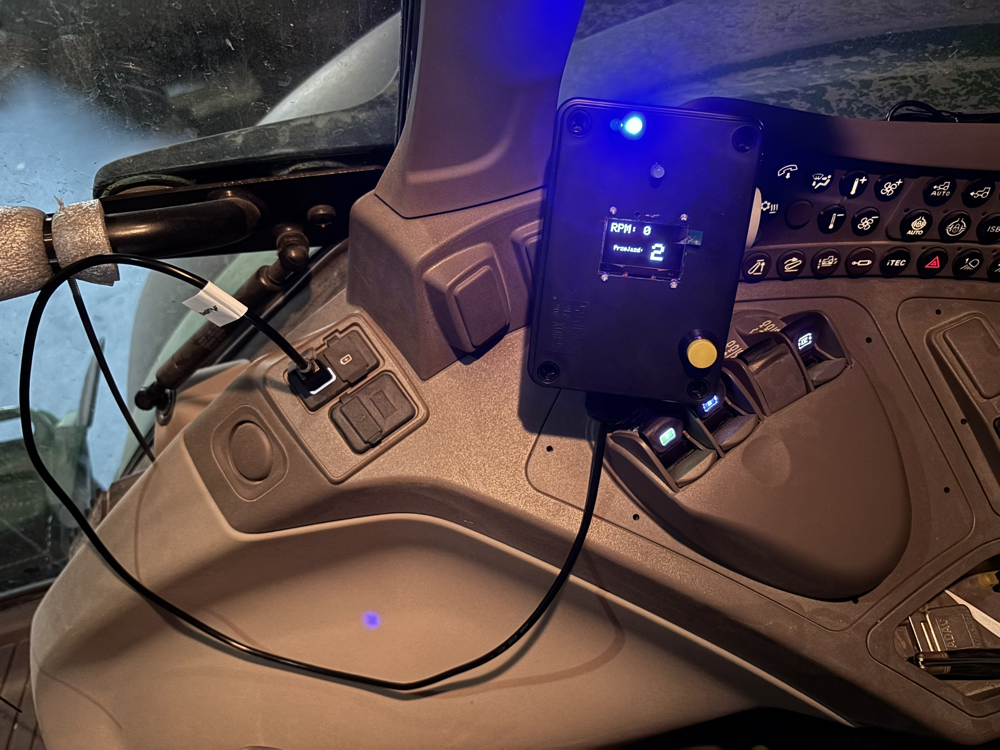
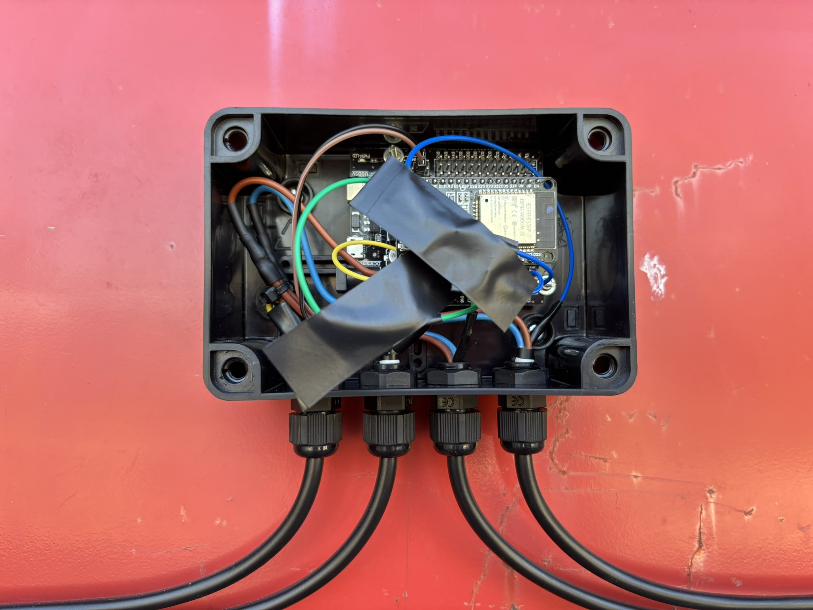
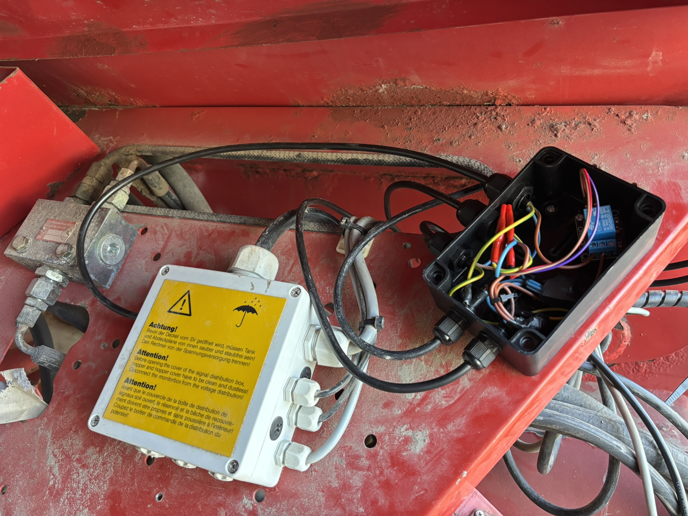
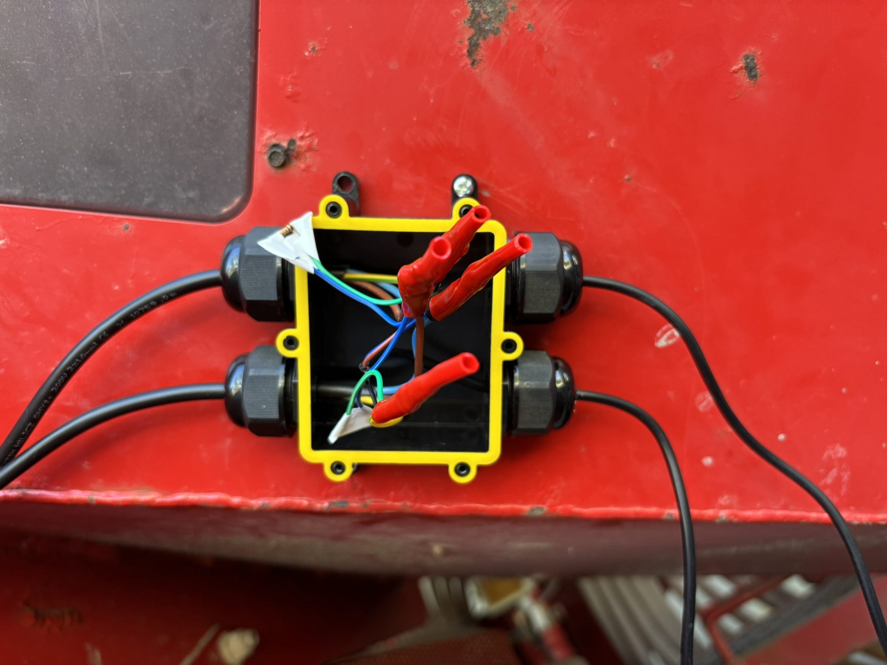
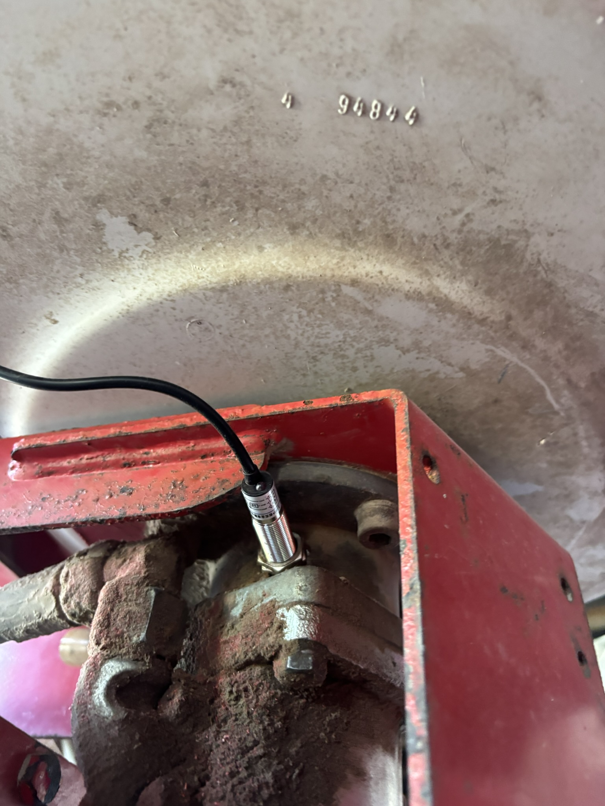
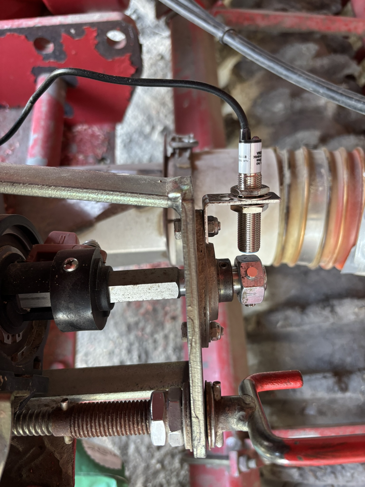
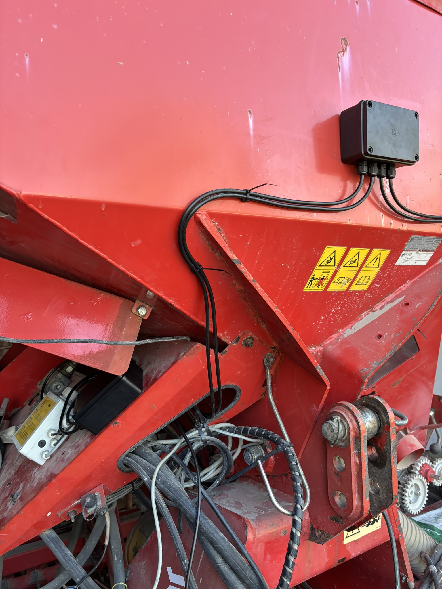

# Wireless controller for Kverneland Accord-like seeders

This project is focused on wireless communication between a tractor and a seeder using ESP-NOW protocol, providing real-time transfer of information about functioning of the seeder, as well as tramline management.
The system mimics the Kverneland FGS Rhythmus functionality, with extra features like fault alerts and monitoring blower RPM.

## Features

### Seeder ESP32

- Measures and calculates RPM for the turbine and metering unit using sensors.
- Detects if the metering unit is actively turning.
- Sends data to the tractor, including:
  - Turbine RPM
  - WOM RPM - TODO
  - Metering unit activity status
  - Tramline activation status
- Activates or deactivates tramlines based on the received data from the tractor.

### Tractor ESP32

- Displays the seeder's data on an OLED screen:
  - Turbine RPM
  - Current tramline number
- Warns the operator of issues with:
  - Turbine RPM
  - WOM RPM
  - Metering unit activity
- Allows manual tramline selection using a button.
- Alerts the operator via an OLED screen and a buzzer in case of faults.

## System Overview

The communication between the tractor and the seeder is handled using ESP-NOW, ensuring low-latency and reliable data exchange. The tractor module provides an interface for the operator, while the seeder module manages the measurements and sends the data back to the tractor.

## Hardware Requirements

### Seeder ESP32:

- ESP32 module
- Inductive sensor for turbine detection
- Hall sensor for metering unit
- Relay module

### Tractor ESP32:

- ESP32 module
- OLED display (128x64, SH1106)
- Button for tramline selection
- LEDs (green, blue, yellow)
- Buzzer

## Software Setup

### Libraries Required

Install the following libraries in the Arduino IDE:

1. Adafruit GFX
2. Adafruit SSD1306

### Seeder Code

The seeder code calculates RPM and determines metering unit activity. It also communicates tramline activation status with the tractor.

### Tractor Code

The tractor code handles user interaction and displays information on the OLED screen. It also monitors the received data for faults.

## Installation

TODO

### Wiring Diagram

TODO

### Uploading the Code

1. Open the respective Arduino sketches for the seeder and tractor.
2. Replace the MAC addresses with the actual MAC addresses of your ESP32 modules.
3. Pick the type of alerts you want to receive and numbers of lines that trigger the tramline relay.
4. Upload the code to the ESP32 devices.

## Operation

1. Install the sensors on the seeder and assemble both modules of the controller.
1. Power up both the tractor and seeder ESP32 modules; green and blue diodes will inform you about the connection state.
1. The seeder module will measure and send data to the tractor.
1. Use the button on the tractor module to switch between tramline modes.
1. Monitor the OLED display for real-time data and fault alerts.

## Demonstration

### Images

Tractor module in tractor waiting for connection.

Main junction box of the seeder module mounted on the front of the seeder.

The interior of the main junction box containing the ESP32 module and three-core cables for power, tramline relay, and sensors.

Junction box with the relay activating the tramlines. There's also an extra cable that delives power to the seed tank (needed for the camera setup).

The sensors connect to ground when activated; otherwise, the circuit remains open. The signal wires are connected to 12V through a pull-up resistor, so when the sensor is activated, the voltage on the signal wire drops to zero.

Sensor mounted on the turbine.

Sensor mounted on the metering unit, along the a set of magnets.

Overview of the seeder module.

### Video

[System in action TODO]()
